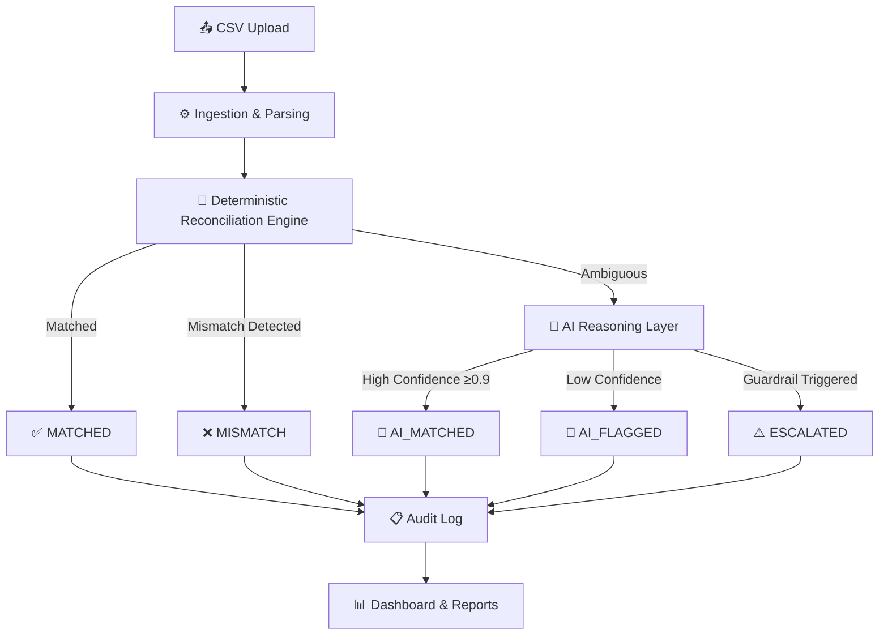

# 💰 Razorpay AI Finance Controller

> **Intelligent financial reconciliation engine combining deterministic rules with AI reasoning** — built for the Razorpay AI Buildathon 2026 (AI Finance Controller Track)

    

---

## 🎯 Problem Statement

Finance teams spend **40+ hours monthly** manually reconciling payments, settlements, and bank statements. Errors slip through, audits are painful, and scaling is impossible. Traditional rule-based systems fail on edge cases — spelling variations, delayed credits, rounding errors — creating a growing pile of "exceptions" that require human intervention.

## 💡 Solution

The **Razorpay AI Finance Controller** solves this with a **hybrid approach**:

1. **Deterministic rules** handle the 85% of cases that can be matched exactly (amount, UTR, date)
2. **AI reasoning** (Google Gemini) handles the remaining 15% — explaining *why* a mismatch occurred and recommending whether records should be matched
3. **Financial guardrails** ensure AI can never override hard invariants (e.g., refund > payment), maintaining auditability and compliance

The result: **60–70% reduction in manual reconciliation workload** with full auditability.

---

## 🏗️ Architecture



### Three-Pass Reconciliation Pipeline

| Pass | What | How |
|------|------|-----|
| **Pass 1** | Payment ↔ Settlement | Match payment_ids, verify net amounts |
| **Pass 2** | Settlement ↔ Bank | Match UTR in bank descriptions, verify amounts & dates |
| **Pass 3** | Refund Verification | Validate refund ≤ payment, detect duplicates |

---

## 🔑 Key Features

- **🔧 Three-Pass Reconciliation** — Payment↔Settlement, Settlement↔Bank, Refund verification
- **🤖 AI Reasoning with Guardrails** — LLM explains ambiguous mismatches but can't override financial invariants
- **📊 Confidence Scoring** — 0.0–1.0 scale with auto-match (≥0.9), review (0.7–0.9), and flag (<0.7) thresholds
- **📋 Full Audit Trail** — Every decision logged with reasoning, timestamps, and state transitions
- **📈 Interactive Dashboard** — Real-time metrics, charts, transaction explorer, mismatch analysis
- **📥 Export Reports** — Download CSV reconciliation reports for compliance
- **🔄 Fallback Mode** — Works without LLM API key using heuristic matching (fuzzy string + date proximity)

---

## 🚀 Quick Start

### Prerequisites
- **Python 3.10+**
- (Optional) [Google Gemini API key](https://aistudio.google.com/app/apikey) for AI features

### Setup

```bash
# Clone the repository
git clone https://github.com/YOUR_USERNAME/razorpay-ai-finance-controller.git
cd razorpay-ai-finance-controller

# Install dependencies
pip install -r requirements.txt

# (Optional) Configure AI features
copy .env.example .env
# Edit .env and add your GEMINI_API_KEY

# Generate sample data
python data/generate_sample_data.py

# Start the API server (terminal 1)
uvicorn app.main:app --port 8000

# Start the dashboard (terminal 2)
streamlit run frontend/dashboard.py
```

**Or on Windows — one command:**
```bash
run.bat
```

Then open:
- **Dashboard:** http://localhost:8501
- **API Docs:** http://localhost:8000/docs

---

## 📊 How It Works

### 1. Deterministic Matching (Pass 1–3)
The engine performs three sequential passes:
- **Pass 1:** Parses settlement records to find grouped payment IDs, then verifies that `sum(payment.amount - fee - tax) ≈ settlement.amount`
- **Pass 2:** Searches bank statement descriptions for settlement UTR numbers, verifying amounts match and dates are within tolerance (±2 days)
- **Pass 3:** Validates each refund against its original payment — ensuring `refund.amount ≤ payment.amount` and detecting duplicate refunds

### 2. AI Reasoning Layer
Records that fail deterministic matching but are ambiguous (e.g., fuzzy UTR match, dates just outside tolerance) are sent to the AI layer:
- Receives full context of both records
- Produces a structured recommendation with confidence score and explanation
- Examples: "Likely a delayed bank credit — same UTR, 3-day gap typical for weekend processing"

### 3. Guardrails
AI recommendations pass through hard guardrails:
- ❌ Amount difference > 5% → Always flagged, regardless of AI confidence
- ❌ Refund > Payment amount → Always flagged
- ✅ AI explanations are always logged for audit compliance

---

## 🛡️ Guardrails & Safety

| Guardrail | Rule | Override? |
|-----------|------|-----------|
| Amount Tolerance | Amount diff > 5% → force flag | Cannot be overridden by AI |
| Refund Limit | Refund > Payment → force flag | Cannot be overridden by AI |
| Audit Logging | Every decision logged | Immutable append-only |
| Fallback Mode | No API key → heuristic matching | Automatic, no config needed |

---

## 🛠️ Tech Stack

| Component | Technology | Why |
|-----------|-----------|-----|
| **Backend API** | FastAPI + Pydantic | Type-safe, async, auto-docs |
| **Database** | SQLite + SQLAlchemy | Zero-config, portable, great for demo |
| **AI Layer** | Google Gemini API | Fast, free tier, structured output |
| **Frontend** | Streamlit + Plotly | Rapid dashboard, interactive charts |
| **Testing** | Pytest | In-memory SQLite for isolated tests |

---

## 📁 Project Structure

```
razorpay-ai-finance-controller/
├── app/
│   ├── main.py                  # FastAPI entry point
│   ├── config.py                # Settings (pydantic-settings)
│   ├── api/
│   │   └── routes.py            # API endpoints
│   ├── core/
│   │   ├── models.py            # SQLAlchemy models + Pydantic schemas
│   │   ├── ingestion.py         # CSV parsing & normalization
│   │   ├── reconciler.py        # 3-pass reconciliation engine
│   │   └── ai_reasoner.py       # AI reasoning + guardrails
│   ├── db/
│   │   └── database.py          # Database setup
│   └── utils/
│       └── report_generator.py  # CSV/summary reports
├── frontend/
│   └── dashboard.py             # Streamlit dashboard
├── data/
│   ├── generate_sample_data.py  # Sample data generator
│   └── sample/                  # Generated CSV files
├── tests/
│   ├── test_reconciler.py       # Reconciliation engine tests
│   └── test_ai_reasoner.py      # AI guardrail tests
├── docs/
│   ├── architecture.md          # Technical architecture
│   └── pitch_outline.md         # 5-min pitch guide
├── requirements.txt
├── .env.example
├── .gitignore
├── run.bat                      # Windows quick start
└── README.md
```

---

## 🧪 Running Tests

```bash
pytest tests/ -v
```

Tests cover:
- ✅ Exact payment-settlement matching
- ✅ Amount mismatch detection
- ✅ Date tolerance (within range / exceeded)
- ✅ Refund validation (valid / exceeding / duplicate)
- ✅ AI guardrail enforcement
- ✅ Confidence threshold behavior
- ✅ Heuristic fallback mode

---

## 📹 Demo Video

[🎬 Watch the 5-minute pitch video](#) *(link to be added)*

---

## 📄 API Endpoints

| Endpoint | Method | Purpose |
|----------|--------|---------|
| `/api/upload/{type}` | POST | Upload CSV (payments/settlements/bank_statement/refunds) |
| `/api/reconcile` | POST | Run full reconciliation pipeline |
| `/api/results` | GET | List results with filters |
| `/api/results/{id}` | GET | Get detail + AI explanation |
| `/api/audit-log` | GET | Fetch audit trail |
| `/api/stats` | GET | Summary statistics |
| `/api/export` | GET | Download CSV report |
| `/api/health` | GET | Health check |

Full interactive docs at: http://localhost:8000/docs

---

## 📝 License

MIT License — see [LICENSE](LICENSE) for details.

---

<div align="center">

**Built with ❤️ for the Razorpay AI Buildathon 2026**

*AI Finance Controller Track — Build. Show. Get hired.*

</div>
