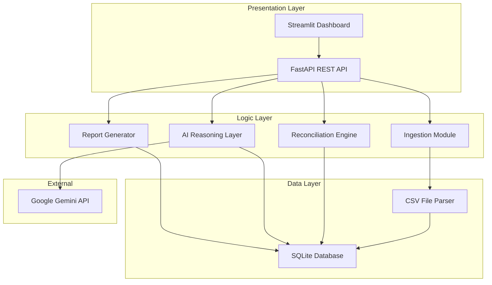
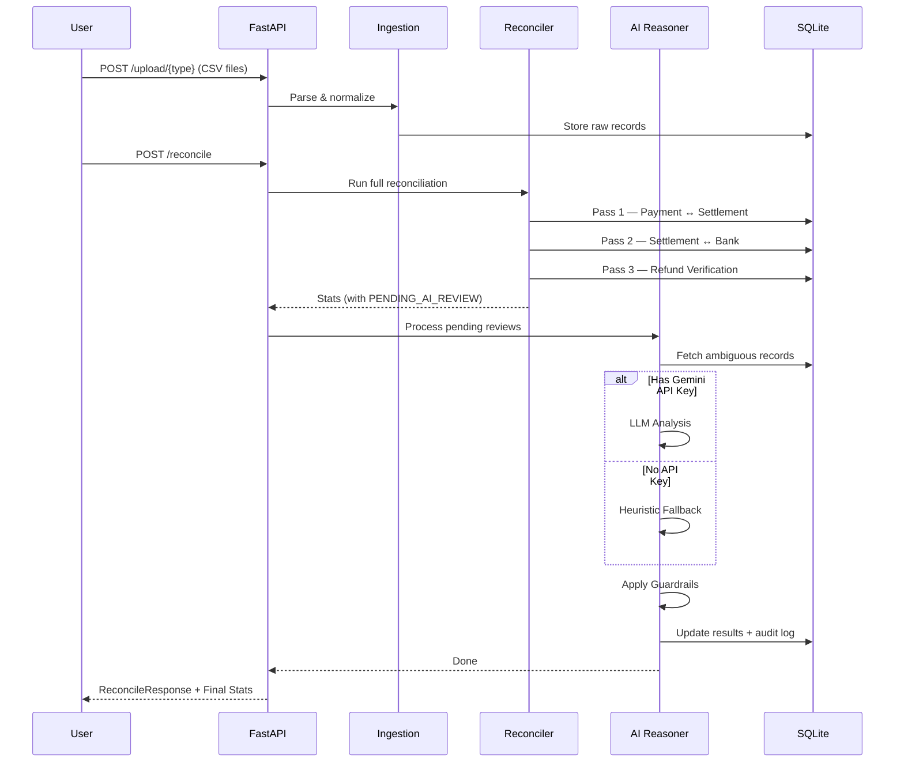
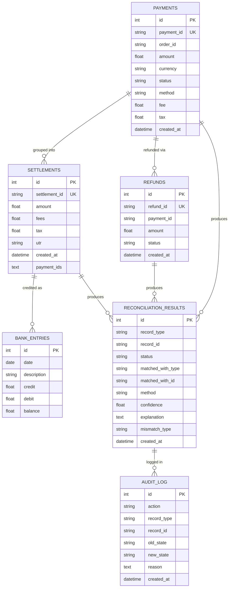

# Technical Architecture — Razorpay AI Finance Controller

## System Overview

The Razorpay AI Finance Controller is a modular financial reconciliation system with four primary layers: **Ingestion**, **Reconciliation Engine**, **AI Reasoning**, and **Presentation**.

---

## Data Flow

### Reconciliation Pipeline

---

## Database Schema

---

## Component Details

### 1. Ingestion Module (`app/core/ingestion.py`)
- Parses CSV files with BOM handling and whitespace normalization
- Supports multiple date formats
- Safe float parsing with comma handling
- Bulk inserts into SQLite via SQLAlchemy

### 2. Reconciliation Engine (`app/core/reconciler.py`)
- **Pass 1 (Payment ↔ Settlement):** Parses `payment_ids` JSON from settlements, matches to payment records, verifies `sum(amount - fee - tax) ≈ settlement.amount` within tolerance
- **Pass 2 (Settlement ↔ Bank):** Searches bank descriptions for UTR strings (exact + fuzzy via `difflib.SequenceMatcher`), verifies amounts and dates within configured tolerance
- **Pass 3 (Refund Verification):** Validates `refund.amount ≤ payment.amount`, detects duplicate refunds per payment
- Each pass creates `ReconciliationResult` and `AuditLog` entries

### 3. AI Reasoning Layer (`app/core/ai_reasoner.py`)
- **LLM Mode:** Sends structured prompts to Gemini 1.5 Flash with full context of both records, parses JSON response
- **Heuristic Mode:** Fuzzy string matching (descriptions), date proximity scoring, amount similarity scoring
- **Guardrails:** Amount diff > tolerance → force flag; Refund > payment → force flag. Guardrails execute AFTER AI analysis and can override any recommendation

### 4. API Layer (`app/api/routes.py`)
- RESTful FastAPI endpoints with Pydantic validation
- Dependency injection for database sessions
- StreamingResponse for CSV export

### 5. Dashboard (`frontend/dashboard.py`)
- Streamlit with Razorpay brand styling
- Plotly charts for status distribution and mismatch breakdown
- Color-coded transaction table with expandable details
- Real-time API integration

---

## Design Decisions

| Decision | Choice | Rationale |
|----------|--------|-----------|
| Database | SQLite | Zero-config, portable, perfect for demo/prototype |
| API Framework | FastAPI | Type-safe, auto-docs, async support |
| Frontend | Streamlit | Rapid development, interactive, professional look |
| AI Provider | Gemini | Free tier, fast, good at structured output |
| Matching Strategy | Deterministic-first | Most records match exactly — AI is expensive and should only handle exceptions |
| Guardrails | Post-AI enforcement | AI sees full context but can't make unsafe decisions |
| Audit Log | Immutable append-only | Compliance requirement — decisions must be traceable |

---

## Scaling Considerations (Production)

For a production deployment, the following changes would be recommended:

1. **Database:** Migrate to PostgreSQL with TimescaleDB for time-series partitioning
2. **Task Queue:** Celery + Redis for async reconciliation of large batches
3. **Data Ingestion:** Razorpay Settlement Recon API (`/v1/settlements/recon/combined`) for real-time data
4. **Monitoring:** Prometheus metrics for match rates, latency, exception counts
5. **Security:** OAuth2 authentication, role-based access control
6. **Caching:** Redis caching for frequently accessed results
